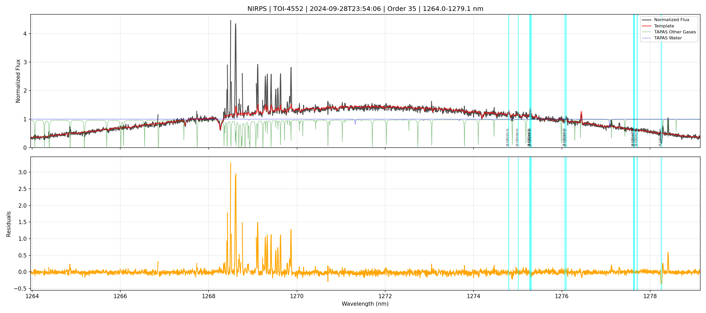

# NIRPS/SPIROU Spectrum Inspector 🔭

Tools to visually inspect and compare NIRPS and SPIROU spectra order-by-order, comparing observations with templates and atmospheric transmission.

**Two scripts included:**
- **`inspect_spectrum.py`** - Inspect a single spectrum against a template
- **`compare_spectra.py`** - Compare two spectra from different pipelines (APERO vs ESO)


*Example: Order 35 of TOI-4552 showing oxygen airglow fluorescence contamination in the residuals. This is the kind of artifact you should look for!*

---

## 📥 Installation

### Step 1: Download the code

```bash
git clone https://github.com/eartigau/spectrum_inspector.git
cd spectrum_inspector
```

Or if you don't have git, download the ZIP from: https://github.com/eartigau/spectrum_inspector/archive/refs/heads/main.zip

### Step 2: Install Python dependencies

```bash
pip install -r requirements.txt
```

Or install manually:
```bash
pip install numpy matplotlib astropy scipy
```

Or with conda:
```bash
conda install numpy matplotlib astropy scipy
```

### Step 3: TAPAS file (automatic download)

The TAPAS atmospheric transmission file is **automatically downloaded** to a `reference_data/` subfolder the first time you run the script.

**Note for clarity:** The script keeps auxiliary reference files (TAPAS atmospheric data and OH emission lines) separate from your actual data files in a `reference_data/` folder. This keeps your working directory clean.

**Alternative:** If the automatic download fails (online storage temporarily unavailable), you can manually copy the file:

```bash
# Create the folder if it doesn't exist
mkdir -p reference_data

# Adjust the path to YOUR lbl installation
cp /path/to/your/lbl/models/tapas_lbl.fits reference_data/
```

### 📁 Folder Structure (after first run)

```
your_working_directory/
├── inspect_spectrum.py          ← Single spectrum inspection
├── compare_spectra.py           ← Cross-pipeline comparison tool
├── requirements.txt             ← Python dependencies
├── README.md
├── reference_data/              ← Auto-created folder for reference files
│   ├── tapas_lbl.fits          ← TAPAS atmospheric data (auto-downloaded, ~172 MB)
│   └── tablea1.dat             ← OH emission lines (auto-downloaded, small)
├── YOUR_SPECTRUM.fits           ← Your APERO t.fits or ESO r. file
├── Template_OBJECTNAME.fits     ← Your template from LBL
└── OUTPUT_PDFS.pdf              ← Generated plots
```

**Important:** Keep your actual data files (spectra, templates, PDFs) in the main folder. The `reference_data/` folder is only for the automatically downloaded reference files.

---

## 📋 What These Tools Do

### inspect_spectrum.py
Creates PDF plots comparing a single spectrum to a template:
- **Page 1: Summary page** with observation info (BERV, systemic velocity, V_tot, files used, etc.)
- **Subsequent pages: One spectral order per page** with:
  - **Your observed spectrum** (black) vs **template spectrum** (red)
  - **Residuals** (observation - template) in orange
  - **TAPAS atmospheric transmission** (water in blue, other gases in green)
  - **OH sky emission lines** (cyan vertical lines)

### compare_spectra.py
Creates PDF plots comparing two spectra from different pipelines (e.g., APERO vs ESO):
- **Page 1: Summary page** with info from both files
- **Subsequent pages: Three-panel comparison** showing:
  - **Panel 1:** Both spectra overlaid with template
  - **Panel 2:** Individual residuals (each spectrum - template)
  - **Panel 3:** Direct difference between the two spectra
- **Warning pages** for orders that don't match between pipelines (APERO has 75 orders, ESO has 71)

---

## 🚀 Quick Start

### inspect_spectrum.py - The Simplest Command

```bash
python inspect_spectrum.py YOUR_SPECTRUM.fits
```

That's it! The script will:
1. Auto-detect the template file based on the object name in your FITS header
2. Generate a multi-page PDF with ALL spectral orders
3. Save it as `NIRPS_OBJECTNAME_DATE_TIMESTAMP_all_orders.pdf`

### compare_spectra.py - Compare Two Pipelines

```bash
python compare_spectra.py APERO_FILE.fits ESO_FILE.fits TEMPLATE.fits
```

This will:
1. Load both spectra and match orders by wavelength overlap
2. Generate a PDF comparing each matched order
3. Add warning pages for orders that exist in only one file

---

## 📦 Required Files

You need **TWO** files in the same folder as the script:

| File | What it is | Where to get it |
|------|-----------|-----------------|
| `*t.fits` | **APERO telluric-corrected spectrum** | From APERO reduction |
| `r.*fits` | **ESO pipeline spectrum** | From ESO pipeline (compare_spectra.py only) |
| `Template_s1dv_OBJECTNAME_sc1d_v_file_A.fits` | Template spectrum | From LBL reduction |

**Note:** The `tapas_lbl.fits` file (atmospheric transmission) is **automatically downloaded** on first use. If the download fails, you can manually copy it from your LBL installation (see Step 3 above).

### Supported File Types

| File Type | Pattern | Description |
|-----------|---------|-------------|
| **APERO** | `*t.fits` | Telluric-corrected files from APERO pipeline |
| **ESO** | `r.*fits` | Files from ESO pipeline (starts with `r.`) |

Both scripts auto-detect the file type and handle the different data structures appropriately.

### ⚠️ CRITICAL for inspect_spectrum.py: Use APERO `t.fits` files!

This script **ONLY** works with **APERO telluric-corrected** files. These are the files whose names end with **`t.fits`**:

```
✅ CORRECT:   NIRPS.2024-09-28T23:54:06.014t.fits   (the 't' = telluric-corrected)
❌ WRONG:     NIRPS.2024-09-28T23:54:06.014e.fits   (extracted, NOT telluric-corrected)
❌ WRONG:     NIRPS.2024-09-28T23:54:06.014o.fits   (NOT telluric-corrected)
❌ WRONG:     NIRPS.2024-09-28T23:54:06.014.fits    (missing the 't')
```

The **`t.fits`** files are produced by APERO after telluric correction. They contain the multi-extension structure with `FluxA`, `BlazeA`, `WaveA` (for NIRPS) or `FluxAB`, `BlazeAB`, `WaveAB` (for SPIROU).

**If you use the wrong file type, you will get an error message.**

---

## 📖 Usage Examples

### inspect_spectrum.py Examples

```bash
python inspect_spectrum.py NIRPS.2024-09-28T23:54:06.014t.fits
```

**Output:** `NIRPS_TOI4552_2024-09-28_235406_all_orders.pdf` (one page per order)

### Example 2: Specify the template explicitly

```bash
python inspect_spectrum.py NIRPS.2024-09-28T23:54:06.014t.fits Template_s1dv_TOI4552_sc1d_v_file_A.fits
```

### Example 3: Look at ONE specific order

```bash
python inspect_spectrum.py NIRPS.2024-09-28T23:54:06.014t.fits --order 50
```

**Output:** Opens a plot window AND saves `NIRPS_TOI4552_2024-09-28_order50.pdf`

### Example 4: Look at a RANGE of orders (e.g., orders 40 to 60)

```bash
python inspect_spectrum.py NIRPS.2024-09-28T23:54:06.014t.fits --order 40 60
```

**Output:** `NIRPS_TOI4552_2024-09-28_orders40-60.pdf` (21 pages)

### Example 5: Just save PDF, don't show plot window

```bash
python inspect_spectrum.py NIRPS.2024-09-28T23:54:06.014t.fits --order 50 --no-show
```

### Example 6: Hide the OH lines and TAPAS (cleaner plot)

```bash
python inspect_spectrum.py NIRPS.2024-09-28T23:54:06.014t.fits --no-oh --no-tapas
```

### Example 7: SPIROU data instead of NIRPS

```bash
python inspect_spectrum.py SPIROU_spectrum.fits --instrument SPIROU
```

---

## 🎛️ All Options

| Option | What it does | Default |
|--------|--------------|---------|
| `file` | Your spectrum FITS file | **REQUIRED** |
| `template` | Template spectrum file | Auto-detected from FITS header |
| `--tapas FILE` | TAPAS transmission file | `tapas_lbl.fits` |
| `--instrument` | `NIRPS` or `SPIROU` | `NIRPS` |
| `--order N` | Plot only order N | All orders |
| `--order N M` | Plot orders N through M | All orders |
| `--no-oh` | Hide OH emission lines | Show them |
| `--no-tapas` | Hide TAPAS transmission | Show it |
| `--no-save` | Don't save PDF | Save PDF |
| `--no-show` | Don't open plot window | Show plot (single order only) |

---

##  Understanding the Plots

### Page 1: Summary Page
Contains all the key observation metadata:
- **Target name** and **instrument**
- **Date of observation**
- **BERV** (Barycentric Earth Radial Velocity)
- **Systemic velocity** (from `HIERARCH ESO TEL TARG RADVEL`)
- **V_tot** = BERV - Vsys (total velocity shift applied)
- **Files used** (spectrum and template)
- **Wavelength range** and number of orders

### Order Pages (Page 2+)

Each page shows TWO panels:

### Top Panel
- **Black line:** Your normalized observed spectrum
- **Red line:** Template spectrum (shifted to your BERV)
- **Blue line:** TAPAS water vapor transmission
- **Green line:** TAPAS other gases (O₂, CO₂, etc.)
- **Cyan vertical lines:** OH sky emission lines (labeled)

### Bottom Panel
- **Orange line:** Residuals (observed - template)
- Good data should scatter around 0
- Systematic features = something interesting (or a problem!)

---

## ❓ Common Issues

### "Template file not found"

The script couldn't find a template matching your object. Either:
1. Provide the template explicitly as the second argument
2. Make sure your template file is named `Template_s1dv_OBJECTNAME_sc1d_v_file_A.fits`

### "TAPAS file not found" or Download Failure

The script automatically downloads the TAPAS file to `reference_data/tapas_lbl.fits` on first use. If the download fails:

1. **Online storage may be temporarily unavailable** - the script will inform you if this happens
2. **Manual solution:** Copy `tapas_lbl.fits` from your LBL installation:
   ```bash
   mkdir -p reference_data
   cp /your/lbl/path/models/tapas_lbl.fits reference_data/
   ```
3. **Direct download:** You can manually download from:
   ```bash
   mkdir -p reference_data
   cd reference_data
   wget http://206.12.93.77/ari/data/lbl/tapas/tapas_lbl.fits
   cd ..
   ```

The file is ~172 MB and only needs to be downloaded once.

### "Order X has no valid data"

That order has NaN values (probably at the edge of the detector). The script automatically skips these orders.

### The PDF has fewer pages than expected

Orders with all-NaN data are automatically skipped. This is normal for edge orders.

---

## 🔧 Using in Python Scripts

You can also import the functions:

```python
from inspect_spectrum import inspect_all_orders, inspect_single_order

# Generate PDF for all orders
inspect_all_orders('spectrum.fits', 'template.fits')

# Generate PDF for orders 30-50
inspect_all_orders('spectrum.fits', 'template.fits', order_min=30, order_max=50)

# Plot a single order (shows plot + saves PDF)
inspect_single_order('spectrum.fits', 'template.fits', order=45)

# Plot without saving
inspect_single_order('spectrum.fits', 'template.fits', order=45, save_pdf=False)
```

---

## 📬 Questions?

Contact: etienne.artigau@umontreal.ca

---
